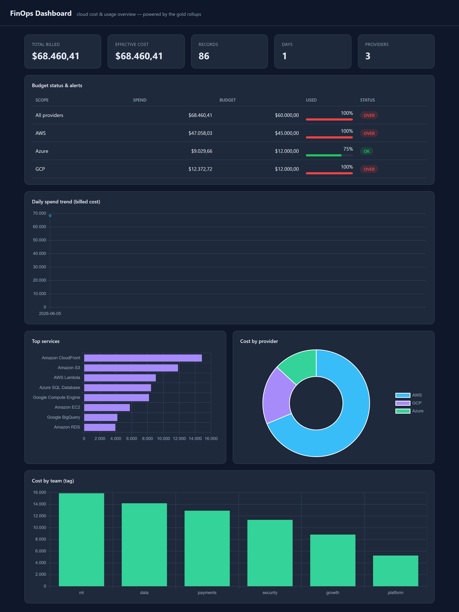

# FinOps Platform

An open-source, event-driven **FinOps** platform for ingesting, processing, and analyzing
cloud cost & usage data. This is a learning/portfolio monorepo built incrementally.



*The Step 5 dashboard: KPIs, budget alerts (OK/WARN/OVER), cost trend, top services,
provider split, and cost-by-team — all served by the FastAPI service over the gold tables.*

## Vision

```
                +------------------------+
   (synthetic)  |   billing-generator    |   <-- step 1 (done)
   cost data -->|  (fake billing source) |
                +-----------+------------+
                            |
                            v
                +------------------------+
                |   message broker       |   <-- step 2 (done: Kafka / Red Panda)
                |  (event backbone)      |
                +-----------+------------+
                            |
              +-------------+-------------+
              v             v             v
        ingestion     transformation   alerting
        service       (gold rollups)   (budgets)
        (step 3 done)  (step 4 done)   (step 5 done)
              \             |             /
               v            v            v
                +------------------------+
                |   API + dashboard      |   <-- FastAPI + Chart.js (step 5 done)
                |  (storage: SQLite)     |
                +------------------------+
```

## Repository layout

```
finops-platform/
├── services/                # Independently deployable services
│   ├── billing-generator/   # Step 1: synthetic FOCUS billing producer
│   ├── ingestion-service/   # Step 3: consumer -> validate -> SQLite
│   ├── aggregation-service/ # Step 4: SQLite -> gold cost rollups
│   └── api-service/         # Step 5: FastAPI API + dashboard + budget alerts
├── libs/                    # Shared, importable Python packages
│   └── common/              # finops_common: shared model + topic names
├── schemas/                 # Language-agnostic data contracts (JSON Schema)
│   └── billing/             # FOCUS-aligned billing record schema
├── infra/                   # Infrastructure (docker, broker, k8s) [grows over time]
├── docs/                    # Architecture, roadmap, ADRs
├── docker-compose.yml       # Local dev environment (brokers + services)
└── Makefile                 # Common dev commands
```

## Design principles

1. **Event-driven & broker-agnostic.** Services emit/consume events through a thin
   abstraction so we can choose **Kafka or Red Panda** later without rewrites.
2. **Contract-first.** Data shapes live in `schemas/` (FOCUS-aligned) and are shared
   via `libs/common`, not duplicated per service.
3. **Independently deployable services.** Each folder in `services/` is self-contained
   (own `pyproject.toml`, `Dockerfile`, tests).

## Quick start (step 1)

```bash
cd services/billing-generator
python -m venv .venv && . .venv/Scripts/activate   # Windows PowerShell: .venv\Scripts\Activate.ps1
pip install -e ".[dev]"

# Emit fake billing to your terminal
billing-generator --sink stdout --interval 2 --batch-size 5
```

## See the dashboard (step 5)

Once data has been ingested and aggregated, **double-click `run-api.bat`** (Windows) — it
opens the dashboard at **http://127.0.0.1:8000** and the API docs at `/docs`. From a shell
you can instead run `make api`, or:

```bash
cd services/api-service
api-service --db-path ../ingestion-service/data/finops.db
```


## Documentation

- [`docs/MANUAL.md`](docs/MANUAL.md) — the full study guide (every step, deep-dived).
- [`docs/roadmap.md`](docs/roadmap.md) — the live roadmap.

## Project history

Every work session is logged in [`docs/devlog.md`](docs/devlog.md) — decisions,
what was built, and why. It's the canonical record of how this project evolved.

## Roadmap

See [`docs/roadmap.md`](docs/roadmap.md). Short version:

- [x] **Step 1** — Synthetic billing generator (FOCUS-aligned)
- [x] **Step 2** — Message broker (Kafka **and** Red Panda) as the event backbone
- [x] **Step 3** — Ingestion service: consume → validate → SQLite (+ dead-letter)
- [x] **Step 4** — Transformation: gold cost rollups (by service / account / provider / tag)
- [x] **Step 5** — API + dashboard + budget alerting (FastAPI + Chart.js)
