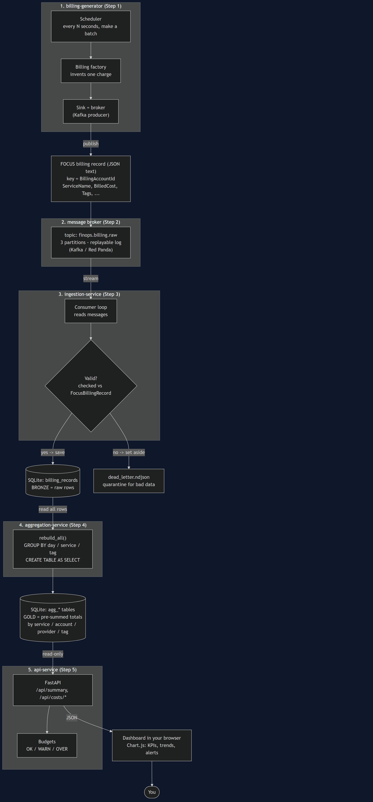
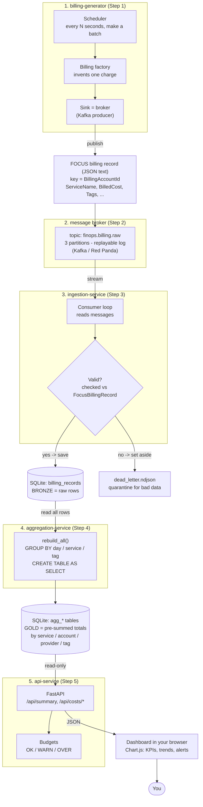

# How the data flows (a beginner's trace)

This page follows **one piece of fake data** from the moment it is invented all the way
to the chart you see in the dashboard. It is the whole project, in one picture, explained
for someone new to this.

> The diagram is written in **Mermaid** (text that GitHub renders as a picture). If your
> editor doesn't render it, just look at the image below — it's the same diagram.





---

## Follow one record, step by step

Imagine a single charge: **account "Acme", service "Amazon S3", billed $12.30, tag team=payments**.

1. **Born (Step 1 - generator).**
   The *billing factory* invents that charge as a Python object, then turns it into a line
   of **JSON text** (the universal data format). The *scheduler* is just a timer that says
   "make a small batch every few seconds," so data keeps flowing like a real cloud account.

2. **Shipped (Step 1 -> 2).**
   The *broker sink* is a **producer**: it hands the JSON to the message broker. It attaches
   a **key** (the account id), which decides *which lane (partition)* the message rides in -
   all of one account's records stay in order together.

3. **Parked on the belt (Step 2 - broker).**
   The broker (Kafka or Red Panda) stores the message in the topic `finops.billing.raw`.
   Think of it as a **conveyor belt that remembers**: reading a message does **not** delete
   it, so the data can be re-read or replayed later. The topic has **3 partitions** (3 lanes)
   so work can be split up.

4. **Picked up (Step 3 - ingestion).**
   The *consumer* pulls the message off the belt.

5. **Checked at the door (Step 3).**
   It **validates** the JSON against the `FocusBillingRecord` schema (the agreed shape).
   - **Good** -> it writes a row into the **SQLite** `billing_records` table. This is the
     **bronze** layer (raw, one row per charge). Writes are **idempotent**: the same record
     can't be saved twice.
   - **Bad** (garbage / wrong shape) -> it's set aside into `dead_letter.ndjson` so it can
     be inspected later. The pipeline keeps running instead of crashing.

6. **Summed up (Step 4 - aggregation).**
   The aggregation service reads **all** the raw rows and computes **totals**: cost per
   service per day, per provider, per account, and **per tag** (so you get "team=payments
   spent $X"). These pre-computed totals are the **gold** tables (`agg_*`). It rebuilds them
   from scratch each run, so running it twice never doubles the numbers.

7. **Served (Step 5 - API + budgets).**
   The API reads only the **gold** tables (read-only = it can never damage your data) and
   answers questions over HTTP, e.g. `/api/summary`. The **budgets** part compares each
   total against a limit and labels it **OK**, **WARN**, or **OVER**.

8. **Seen (Step 5 - dashboard).**
   Your browser opens the dashboard, which calls those API endpoints and **draws the charts**
   - the KPIs, the trend line, the top services, and the colored budget alerts.

---

## The same journey in one line

```
fake charge -> JSON -> broker topic -> validate -> SQLite (bronze)
            -> aggregate -> agg_* (gold) -> API + budgets -> dashboard -> you
```

## Two ideas worth remembering

- **Bronze vs gold.** Bronze = every raw charge (lots of rows). Gold = the answers
  pre-computed (few rows). Dashboards read gold, so they're fast.
- **The belt remembers.** Because the broker keeps events, you can add a *new* consumer
  later and let it re-read history - without touching the generator. That decoupling is the
  whole point of an event-driven system.
