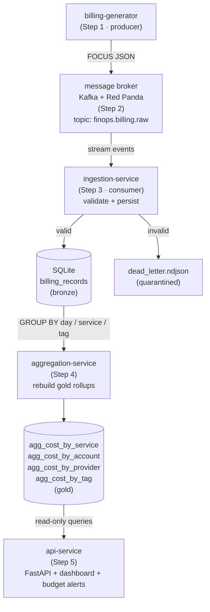
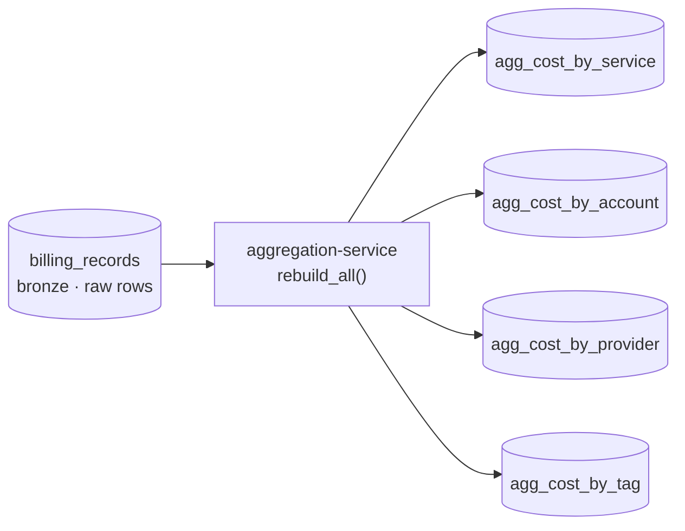
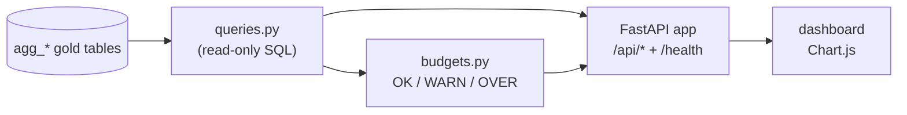

# FinOps Platform — Project Manual

A complete, study-oriented guide to an **event-driven FinOps platform** built
incrementally in Python. It explains the *why* behind every decision, the
*concepts* you need to understand it, and the *how* to run it yourself.

> **What is this project?** A small but realistic platform that ingests, processes,
> and analyzes cloud **cost & usage** data — the discipline known as **FinOps**
> (Financial Operations). It is built step by step as a learning + portfolio project.

---

## Table of contents

1. [The big picture](#1-the-big-picture)
2. [Architecture at a glance](#2-architecture-at-a-glance)
3. [Technology stack](#3-technology-stack)
4. [Core concepts glossary](#4-core-concepts-glossary)
5. [Repository structure](#5-repository-structure)
6. [Step 1 — Synthetic billing generator](#6-step-1--synthetic-billing-generator)
7. [Step 2 — Message broker (Kafka & Red Panda)](#7-step-2--message-broker-kafka--red-panda)
8. [Step 3 — Ingestion service](#8-step-3--ingestion-service)
9. [Step 4 — Transformation (gold rollups)](#9-step-4--transformation-gold-rollups)
10. [Step 5 — API + dashboard + budget alerts](#10-step-5--api--dashboard--budget-alerts)
11. [Running the whole platform](#11-running-the-whole-platform)
12. [Python & engineering concepts learned](#12-python--engineering-concepts-learned)
13. [Roadmap (what's next)](#13-roadmap-whats-next)
14. [What this project demonstrates](#14-what-this-project-demonstrates)

---

## 1. The big picture

### The real-world problem
Companies run software on the cloud (AWS, Azure, GCP). Every resource — servers,
databases, storage — costs money, and providers return enormous, messy **billing
files**. **FinOps** is the practice of understanding and controlling that spend, by
answering questions like:

- *Why did our bill jump 40% last week?*
- *Which team or service is the most expensive?*
- *Are we about to blow our budget?*

This platform builds the machinery to answer those questions.

### Why "event-driven"?
There are two ways to move data through a system:

| Style | How it works | Problem |
|-------|--------------|---------|
| **Request/response (batch)** | Components call each other directly | Tight coupling; one failure cascades; hard to scale |
| **Event-driven** | Components communicate through a **message broker** (a conveyor belt) | Decoupled, resilient, scalable |

**The conveyor-belt metaphor:** a *producer* drops items (events) on a belt and walks
away. *Consumers* pick items off the belt at their own pace. Producers and consumers
never talk directly — they only know about "the belt." This **decoupling** is the
entire point:

- Add new consumers without touching the producer.
- One consumer crashing doesn't stop the producer.
- Fast producers and slow consumers coexist (the belt **buffers**).
- The belt **remembers** events (durability), so consumers can replay history.

The crucial twist: a Kafka-style belt is a **replayable log**, not a one-time mailbox.
Reading an event does **not** delete it — many independent consumers can read the same
events, and new services can re-read history from the beginning.

---

## 2. Architecture at a glance

```
                +------------------------+
   (synthetic)  |   billing-generator    |   Step 1  (producer)
   cost data -->|  (fake billing source) |
                +-----------+------------+
                            | emits FOCUS billing records (JSON)
                            v
                +------------------------+
                |   message broker       |   Step 2  (event backbone)
                |  Kafka  +  Red Panda   |   topic: finops.billing.raw (3 partitions)
                +-----------+------------+
                            | streams events
                            v
                +------------------------+
                |   ingestion-service    |   Step 3  (consumer)
                |  validate + persist    |
                +-----+------------+-----+
                      |            |
                valid |            | invalid
                      v            v
              +-------------+  +------------------+
              |   SQLite    |  | dead_letter.ndjson|
              | billing_    |  | (quarantined bad  |
              | records     |  |  records)         |
              +------+------+  +------------------+
                     |
                     v
            SQL analytics (cost by service / provider / team / period)
            Step 4 (aggregation) and Step 5 (API + dashboard) build on this.
```

The same pipeline as a diagram (renders on GitHub):



### Data flow in one sentence
The **generator** invents realistic cloud charges and publishes them to a **broker**;
the **ingestion service** consumes them, **validates** each against a shared contract,
and **lands** valid records in **SQLite** (sending bad ones to a **dead-letter** file),
where they can be analyzed with SQL.

---

## 3. Technology stack

| Concern | Choice | Why |
|---------|--------|-----|
| Language | **Python 3.10+** | Readable, batteries-included |
| Data modeling / validation | **pydantic v2** | Typed models with automatic validation + JSON |
| Settings | **pydantic-settings** | 12-factor config from env vars |
| Fake data | **Faker** | Realistic company names, etc. |
| Data format | **FOCUS** spec | Industry-standard cloud cost & usage shape |
| Broker | **Apache Kafka** + **Red Panda** | Same protocol; both run side by side |
| Kafka client | **confluent-kafka** | Works unchanged against Kafka or Red Panda |
| Storage | **SQLite** | Real SQL, zero setup |
| API | **FastAPI** + **uvicorn** | Typed endpoints, auto OpenAPI docs |
| Dashboard | **Chart.js** (CDN) | Charts with no build step |
| Containers | **Docker / Docker Compose** | Reproducible local environment |
| Testing | **pytest** | Fast, convention-based |
| Lint/format | **ruff** | Fast, all-in-one |

---

## 4. Core concepts glossary

### Software design concepts

- **Class vs. object (instance)** — a class is a *blueprint*; an object is a *thing built
  from it*. `FocusBillingRecord` is a class; each generated charge is an object.
- **Method** — a function that belongs to a class (an action an object can perform).
- **Sink** — a data-flow metaphor: the *destination* where data drains to (screen,
  file, broker). Opposite of a *source*.
- **Contract / interface** — a promise about *what methods* something must have, without
  saying how they work (like a wall socket: any matching plug gets power).
- **Abstract base class (`abc.ABC`) / abstract method (`@abstractmethod`)** — how Python
  writes a contract: a template that *cannot* be instantiated and that forces subclasses
  to implement specific methods.
- **Factory** — a function whose job is to build and return the right object, so callers
  don't need construction details (e.g. `build_sink("file")` returns a `FileSink`).
- **Strategy pattern** — a family of interchangeable behaviors behind one contract,
  chosen at runtime (the sinks).
- **Polymorphism** — different objects responding to the same call in their own way
  (`sink.emit(record)` behaves differently per sink, with no `if`-checks).
- **Inheritance / subclass / override** — building a class on top of another, reusing its
  behavior and replacing parts as needed.
- **Dependency injection** — passing a component its collaborators (the scheduler is
  *given* a generator and a sink, instead of creating them itself).

### Event-streaming concepts

- **Producer** — publishes events to the broker (the billing generator).
- **Consumer** — reads events to do work (the ingestion service).
- **Broker** — the server(s) that store and serve the event log (Kafka / Red Panda).
- **Topic** — a named stream/belt (`finops.billing.raw`).
- **Partition** — a topic is split into ordered sub-logs for parallelism. Order is
  guaranteed *within* a partition, not across partitions.
- **Key → partition** — a record's key decides its partition (we key by
  `BillingAccountId`, so one account's records stay ordered together).
- **Offset** — a record's position number within its partition (never changes).
- **Consumer group** — a team of consumers sharing partitions; different groups read the
  same events independently.
- **Retention** — how long events stay on the log (enables replay).
- **Replication** — copies of partitions across brokers (durability).
- **Advertised listeners** — the address a broker tells clients to reach it at; needs to
  be correct for the caller's network (host vs. inside Docker).
- **At-least-once delivery** — a record may be delivered more than once; combine with
  **idempotent** writes so duplicates don't double-count.
- **Dead-letter queue (DLQ)** — where invalid/unprocessable messages go, so they're
  neither dropped nor allowed to crash the pipeline.

---

## 5. Repository structure

A **monorepo** (many projects in one git repository):

```
FinOPS Project/
├── services/                     # Independently deployable programs
│   ├── billing-generator/        # Step 1: synthetic FOCUS billing producer
│   │   ├── src/billing_generator/
│   │   │   ├── config.py          # settings (env vars)
│   │   │   ├── generators/        # accounts catalog + billing factory
│   │   │   ├── sinks/             # stdout | file | broker (+ factory)
│   │   │   ├── scheduler.py       # the timer loop
│   │   │   └── main.py            # CLI
│   │   └── tests/
│   ├── ingestion-service/        # Step 3: consumer -> validate -> SQLite
│   │   ├── src/ingestion_service/
│   │   │   ├── config.py
│   │   │   ├── storage/           # base | sqlite_store | dead_letter
│   │   │   ├── consumer.py        # validation + consume loop
│   │   │   └── main.py            # CLI
│   │   └── tests/
│   ├── aggregation-service/      # Step 4: SQLite -> gold rollups
│   │   ├── src/aggregation_service/
│   │   │   ├── transform.py       # CREATE TABLE AS SELECT rollups
│   │   │   └── main.py            # CLI (--report)
│   │   └── tests/
│   └── api-service/              # Step 5: FastAPI API + dashboard + budgets
│       ├── src/api_service/
│       │   ├── queries.py         # read-only gold queries
│       │   ├── budgets.py         # OK/WARN/OVER evaluation
│       │   ├── app.py             # FastAPI factory + endpoints
│       │   ├── static/index.html  # Chart.js dashboard
│       │   └── main.py            # uvicorn CLI
│       └── tests/
├── libs/
│   └── common/                   # finops_common: SHARED contract
│       └── src/finops_common/
│           ├── models.py          # FocusBillingRecord (authoritative)
│           └── topics.py          # canonical topic names
├── schemas/billing/              # JSON Schema (language-neutral contract)
├── infra/                        # infrastructure notes (grows over time)
├── docs/                         # architecture, roadmap, ADRs, this manual
├── docker-compose.yml            # brokers + services (profiles)
└── Makefile                      # common dev commands
```

**Key conventions**
- `services/` = things you *run*; `libs/` = things you *import*; `schemas/` = contracts.
- **src layout** (`src/<package>/`) forces installing the package, so tests run against
  the installed version (like a real user).
- Folder names use hyphens (`billing-generator`); Python package names use underscores
  (`billing_generator`), because `-` is invalid in Python identifiers.
- **Contract-first**: the billing record is defined **once** in `libs/common` and
  imported by every service, so the shape never drifts.

---

## 6. Step 1 — Synthetic billing generator

**Goal:** because we have no real cloud account, we *fake* a realistic, continuous source
of cloud-cost data, shaped like a genuine bill.

### 6.1 The data model (`finops_common/models.py`)
A **pydantic model** defines one billing record as a typed "form." It gives us free
**validation** (wrong types are rejected) and **serialization** (to/from JSON).

```python
class FocusBillingRecord(BaseModel):
    RecordId: str                       # required
    ProviderName: str
    PublisherName: str | None = None    # optional (may be empty)
    BillingAccountId: str
    BillingPeriodStart: datetime        # the invoice cycle (e.g. the month)
    BillingPeriodEnd: datetime
    ChargePeriodStart: datetime         # when THIS usage happened (e.g. one hour)
    ChargePeriodEnd: datetime
    ServiceName: str                    # "Amazon EC2"
    ServiceCategory: str                # "Compute"
    ChargeCategory: str                 # Usage | Purchase | Tax | Credit
    RegionId: str
    ResourceId: str
    PricingQuantity: float = Field(ge=0) # guardrail: must be >= 0
    PricingUnit: str
    ListUnitPrice: float = Field(ge=0)
    ListCost: float                     # sticker price (quantity * unit price)
    EffectiveCost: float                # real cost after discounts
    BilledCost: float                   # what was invoiced
    BillingCurrency: str
    Tags: dict[str, str] = Field(default_factory=dict)  # team/env/cost_center
```

**FOCUS concepts modeled here**
- **Two time windows:** `BillingPeriod` (the monthly invoice) vs `ChargePeriod` (when a
  specific charge happened). One monthly bill contains thousands of tiny charge periods.
- **Three costs:** `ListCost` (sticker), `EffectiveCost` (after discounts),
  `BilledCost` (invoiced). FinOps analysis lives in the gaps between them.
- **Tags:** key/value labels for cost allocation (which team/environment).

> `Field(default_factory=dict)` (not `= {}`) gives each record its **own** empty dict,
> avoiding the classic shared-mutable-default bug.

### 6.2 The generators
- **`accounts.py` — the catalog.** Builds a **stable** cast of accounts, priced services,
  and regions **once** (seeded for reproducibility). Mirrors reality: your account list is
  stable month to month. Uses `@dataclass`, `random.Random(seed)`, and `Faker`.
- **`billing.py` — the factory.** On demand, picks from the catalog and assembles a
  `FocusBillingRecord` with fresh values: random quantity, computed `ListCost`, a discount
  for `EffectiveCost`, a `uuid4` id, and a 1-hour charge window ending "now". Charge
  categories follow a realistic distribution (≈88% Usage, plus Purchase/Tax/Credit); a
  `Credit` is **negative**, a `Tax` has no quantity.

### 6.3 The sinks (Strategy pattern)
`Sink` is the **contract** (`abc.ABC` with abstract `emit`). Implementations:

| Sink | Destination |
|------|-------------|
| `StdoutSink` | prints JSON lines to the screen |
| `FileSink` | appends to an NDJSON file (auto-creates folder, flush/close) |
| `BrokerSink` | publishes to Kafka/Red Panda (keyed by account, idempotent) |

`build_sink(settings)` is the **factory** that returns the chosen one. The generator only
ever calls `sink.emit(record)` — **polymorphism** means it never needs to know which sink
it has. Adding a new destination = one new class, zero changes elsewhere.

### 6.4 The scheduler (`scheduler.py`)
The orchestrator: every `interval_seconds`, generate `batch_size` records and emit them,
until stopped. Features:
- **Graceful shutdown** via OS **signals** (`SIGINT`/Ctrl+C, `SIGTERM`): a handler flips a
  `self._stop` flag; the loop finishes cleanly and flushes — no lost data.
- **Context manager** (`with self._sink:`) guarantees flush + close on exit (even on
  error).
- `--max-batches` stops after N; otherwise runs until interrupted.

### 6.5 The CLI (`main.py`)
Uses **argparse** to define flags (`--sink`, `--batch-size`, `--interval`, `--seed`,
`--max-batches`, `--file-path`). Settings precedence:

```
built-in defaults  <  environment variables (BILLING_*)  <  CLI flags
```

`if __name__ == "__main__": main()` lets the file be imported by tests without running.
The terminal command `billing-generator` exists because of `[project.scripts]` in
`pyproject.toml`.

### 6.6 Tests
8 pytest tests cover determinism, valid records, batch size & unique IDs, JSON
round-trips, valid charge categories, the file sink (using the `tmp_path` fixture), and
the factory (including that bad input **raises** correctly).

### 6.7 Example output (one record, formatted)
```json
{
  "RecordId": "3c52d0bd-...",
  "ProviderName": "GCP",
  "BillingAccountId": "acct-8479902459",
  "BillingPeriodStart": "2026-06-01T00:00:00Z",
  "BillingPeriodEnd":   "2026-07-01T00:00:00Z",
  "ChargePeriodStart":  "2026-06-05T18:14:28Z",
  "ChargePeriodEnd":    "2026-06-05T19:14:28Z",
  "ServiceName": "Google BigQuery",
  "ServiceCategory": "Analytics",
  "ChargeCategory": "Usage",
  "PricingQuantity": 603.77, "PricingUnit": "TB-Scanned",
  "ListCost": 924.66, "EffectiveCost": 824.70, "BilledCost": 824.70,
  "BillingCurrency": "USD",
  "Tags": {"environment": "prod", "team": "growth", "cost_center": "cc-180"}
}
```

---

## 7. Step 2 — Message broker (Kafka & Red Panda)

**Goal:** introduce the event backbone between producer and consumers.

### 7.1 Kafka in plain terms
Kafka is a **distributed, append-only log**: a notebook you can only add to the end of,
copied across machines for safety. Vocabulary (see glossary): **broker, topic, partition,
offset, consumer group, retention, replication**.

### 7.2 Kafka vs Red Panda
Both speak the **same Kafka protocol**, so your code is identical; only the engine and
operations differ.

| Aspect | Apache Kafka | Red Panda |
|--------|--------------|-----------|
| Built in | Java/Scala (JVM) | C++ (single binary) |
| Footprint (local) | Heavier | Lighter, faster start |
| Ecosystem | The industry standard | Smaller, drop-in compatible |
| Console | Add separately | Ships an easy web console |
| Your code (`confluent-kafka`) | **Same** | **Same** |

**Decision (ADR-0002):** run **both** locally behind Compose profiles; choosing between
them is a *config* change (`bootstrap.servers`), not a code change.

### 7.3 Topic & partitioning
- Topic: `finops.billing.raw`, **3 partitions**.
- Records keyed by `BillingAccountId` → a given account always lands on the **same**
  partition → its records stay **in order**. Different accounts spread across partitions
  for parallelism. (Verified live: Kafka and Red Panda assigned identical key→partition.)

### 7.4 The advertised-listener lesson
A broker tells clients "reach me at this address." When clients live in different network
contexts (your host vs. inside Docker), you need **separate named listeners**:

- **Red Panda:** `EXTERNAL` advertised as `localhost:9092` (host), `INTERNAL` as
  `redpanda:9093` (other containers, e.g. the console).
- **Kafka:** `HOST` advertised as `localhost:9094`, `DOCKER` as `kafka:9092`.

This is one of the most common real-world Kafka stumbling blocks.

### 7.5 Ports
| Service | Host port |
|---------|-----------|
| Red Panda (Kafka API) | `9092` |
| Apache Kafka (Kafka API) | `9094` |
| Red Panda Console (web UI) | `8080` |

---

## 8. Step 3 — Ingestion service

**Goal:** consume raw events, validate them, and land them where they can be analyzed.

### 8.1 What it does
```
finops.billing.raw  ──►  ingestion-service  ──►  SQLite (billing_records)
                              │
                              └── invalid ──►  dead_letter.ndjson
```

### 8.2 The consumer loop (`consumer.py`)
- Creates a `confluent_kafka.Consumer` with a **`group.id`**,
  `auto.offset.reset=earliest`, and **`enable.auto.commit=False`** (we commit manually).
- `subscribe()` to the topic, then loop: `poll()` → handle → **commit after handling**.
- The per-message logic is a **broker-free** function, `process_message`, so it can be
  unit-tested with plain bytes.

### 8.3 Validation at the boundary
```python
record = FocusBillingRecord.model_validate_json(value)  # bytes -> trusted object
```
If the bytes aren't valid JSON, or the shape is wrong (missing required fields, bad
types), pydantic raises — and the message is **dead-lettered** instead of crashing the
service.

### 8.4 At-least-once + idempotency
- Offsets are committed **only after** a message is handled → no message is lost if the
  service dies mid-processing (it may be re-delivered).
- The SQLite write uses `INSERT OR REPLACE` keyed on `RecordId` → a re-delivered record
  **overwrites** rather than duplicating. Together: **no loss, no double-counting.**

### 8.5 Storage (`storage/`)
- `Store` (abstract, mirrors the `Sink` idea) → `SQLiteStore` (creates the
  `billing_records` table, idempotent upsert) and `DeadLetterWriter` (appends bad payloads
  + error + original bytes to NDJSON).

### 8.6 The dead-letter demo (proven)
Injecting 2 bad messages among 88 produced: **stored 86, dead-lettered 2, 0 crashes**.
The DLQ file captured each bad payload with its error (e.g. "16 issues" for a record
missing all required fields) and the original bytes for replay.

### 8.7 Example analytics (SQL over landed data)
```
TOTAL records: 86 | TOTAL billed: USD 68,460.41

Top services:   Amazon CloudFront $14,840  | Amazon S3 $11,830 | AWS Lambda $9,039
By provider:    AWS $47,058 | GCP $12,372 | Azure $9,029
By category:    Usage (75) $65,007 | Tax (4) $2,819 | Purchase (4) $1,755 | Credit (3) -$1,121
```
Note credits are **negative** — the Step-1 logic survives all the way to analytics.

---

## 9. Step 4 — Transformation (gold rollups)

**Service:** `services/aggregation-service` · **Reads:** `billing_records` · **Writes:** `agg_*` tables

### 9.1 Why a transformation step?
Running `GROUP BY` over millions of raw rows on *every* dashboard load is slow and
wasteful. Instead we compute the answers **once** and store them in small, ready-to-read
**gold** tables. This is the **medallion architecture**:

```
billing_records (bronze · raw, one row per charge)
        │  aggregation-service  (GROUP BY day, service, account, provider, tag)
        ▼
agg_cost_by_service / _account / _provider / _tag   (gold · pre-summed)
```



### 9.2 Idempotent by construction
Each rollup is rebuilt with **`CREATE TABLE AS SELECT`** (drop + recreate). Running the
transformation twice produces **identical** tables — numbers never double. That makes it
safe to re-run on a schedule, the cornerstone of reliable data pipelines.

```python
for table, select_sql in _ROLLUPS:
    conn.execute(f"DROP TABLE IF EXISTS {table}")
    conn.execute(f"CREATE TABLE {table} AS {select_sql}")
```

### 9.3 The four gold tables
All are bucketed by **usage day** (`date(charge_period_start)`):

| Table | Grain | Answers |
|-------|-------|---------|
| `agg_cost_by_service`  | day × service  | "Which services cost the most?" |
| `agg_cost_by_account`  | day × account  | "Which tenant/customer is most expensive?" |
| `agg_cost_by_provider` | day × provider | "How is spend split across AWS/Azure/GCP?" |
| `agg_cost_by_tag`      | day × tag k/v  | "What does each team / environment cost?" |

### 9.4 Cost-by-tag with `json_each`
Tags are stored as a JSON column. SQLite's **`json_each`** expands that JSON into one
row per key/value, so a single `GROUP BY` allocates cost across `team`, `environment`,
and `cost_center` — the heart of FinOps **cost allocation (showback/chargeback)**:

```sql
SELECT date(b.charge_period_start) AS usage_date,
       t.key AS tag_key, t.value AS tag_value,
       ROUND(SUM(b.billed_cost), 6) AS billed_cost
FROM billing_records AS b, json_each(b.tags) AS t
GROUP BY usage_date, tag_key, tag_value;
```

### 9.5 Tests
Four tests (`tests/test_transform.py`) seed a tiny in-memory dataset and assert:
correct service sums (`100 + 50 = 150`), correct tag expansion (`payments = 150`), all
gold tables created, and **idempotency** (running `rebuild_all` twice yields equal counts).

### 9.6 Proven output (over the 86 landed records)
```
rebuilt gold tables: agg_cost_by_service=10, agg_cost_by_account=12,
                     agg_cost_by_provider=3, agg_cost_by_tag=93

Top services by billed cost      Cost by tag: team
  Amazon CloudFront  $14,840.86    ml         $15,891.59
  Amazon S3          $11,830.99    data       $14,185.85
  AWS Lambda          $9,039.77    payments   $12,916.51
  Azure SQL Database  $8,434.56    security   $11,354.20
  Google Compute Eng. $8,179.16    growth      $8,846.94
```

---

## 10. Step 5 — API + dashboard + budget alerts

**Service:** `services/api-service` · **Reads:** gold `agg_*` tables · **Serves:** JSON + HTML

### 10.1 What it does
The previous steps produce data; Step 5 finally **exposes** it. A small **FastAPI** app
turns the gold tables into a read API, evaluates **budgets** into alerts, and serves a
**dashboard** — the layer a FinOps stakeholder actually interacts with.



### 10.2 The endpoints
FastAPI auto-generates interactive docs at **`/docs`** (Swagger UI) from the type hints.

| Path | Returns |
|------|---------|
| `/` | HTML dashboard |
| `/health` | status + whether gold tables exist |
| `/api/summary` | totals (billed, effective, records, days, providers) |
| `/api/costs/by-service?limit=N` | top services |
| `/api/costs/by-provider` | per-provider cost |
| `/api/costs/by-account?limit=N` | per-account cost |
| `/api/costs/by-tag?key=team` | cost allocated by a tag |
| `/api/costs/timeseries` | daily total billed cost (trend) |
| `/api/budgets` | budget status + active alerts |

### 10.3 Three design choices worth knowing
- **App factory** — `create_app(settings)` builds the app from injected settings, so a
  test can spin up the API against a temporary database. `app = create_app()` at import
  time is what uvicorn serves in production.
- **Read-only connections** — the API opens SQLite with `file:...?mode=ro`. It physically
  *cannot* modify the data it serves — a clean safety boundary.
- **Graceful "not ready"** — if the gold tables are missing, queries raise `GoldNotReady`
  and the API returns **HTTP 503** with "run the aggregation service first" instead of a
  cryptic 500.

### 10.4 Budgets → alerts
`budgets.py` is pure (no DB), so it's trivially testable. The rule:

```
ratio = spend / budget
ratio <  0.8   -> OK
0.8 <= ratio < 1.0 -> WARN
ratio >= 1.0   -> OVER
```

`evaluate()` grades the **total** and each **provider**, then collects every WARN/OVER
into an `alerts` list with a count — exactly what a dashboard banner or notification job
would consume.

### 10.5 The dashboard
`static/index.html` is a single self-contained page (Chart.js via CDN). On load it calls
the JSON endpoints in parallel and renders KPI cards, a **budget table** with colored
status badges, a daily **trend** line, a **top-services** bar, a **provider** doughnut,
and a **cost-by-team** bar. No build step, no framework — it just consumes the API.

### 10.6 Proven output (live, over the 86 landed records)
```
GET /api/summary   -> total_billed 68,460.41 | records 86 | providers 3
GET /api/budgets   -> overall OVER (68,460 / 60,000 = 1.14)
                      AWS  OVER (47,058 / 45,000)   Azure OK (9,030 / 12,000)
                      GCP  OVER (12,373 / 12,000)   alert_count = 3
```

### 10.7 Tests
Nine tests (`tests/test_api.py`) use FastAPI's `TestClient` over a seeded temp DB:
health/gold-ready, summary totals, provider ordering, tag lookup, dashboard HTML,
budget OVER/WARN flagging, the 503 path, plus pure `status_for`/`evaluate` unit tests.

---

## 11. Running the whole platform

> Prerequisites: Python 3.10+, Docker Desktop running. Commands shown for Windows
> PowerShell; adjust paths/venv activation for macOS/Linux.

### 11.1 Install (editable)
```powershell
# from the repo root
pip install -e libs/common
cd services/billing-generator ; pip install -e ".[dev,broker]" ; cd ../..
cd services/ingestion-service ; pip install -e ".[dev]" ; cd ../..
cd services/aggregation-service ; pip install -e ".[dev]" ; cd ../..
cd services/api-service ; pip install -e ".[dev]" ; cd ../..
```
(Or, where `make` is available: `make install`.)

### 11.2 Start a broker
```powershell
# Red Panda (has a web console at http://localhost:8080)
docker compose --profile redpanda up -d

# Apache Kafka (host port 9094)
docker compose --profile kafka up -d

# Both at once
docker compose --profile redpanda --profile kafka up -d
```

### 11.3 Create the topic (3 partitions)
```powershell
# Red Panda
docker exec finops-redpanda rpk topic create finops.billing.raw --partitions 3 --replicas 1

# Kafka (note: use the in-Docker listener kafka:9092)
docker exec finops-kafka /opt/kafka/bin/kafka-topics.sh --bootstrap-server kafka:9092 `
  --create --topic finops.billing.raw --partitions 3 --replication-factor 1
```

### 11.4 Produce billing records
```powershell
cd services/billing-generator

# To the screen (deterministic with a seed)
billing-generator --sink stdout --batch-size 3 --seed 42 --max-batches 1

# Stream to Red Panda (default broker localhost:9092)
billing-generator --sink broker --batch-size 4 --interval 2 --max-batches 20

# Stream to Kafka instead
$env:BROKER_BOOTSTRAP_SERVERS="localhost:9094"; billing-generator --sink broker --max-batches 5
```

### 11.5 Consume into SQLite
```powershell
cd services/ingestion-service
ingestion-service --from-beginning --max-messages 100        # Red Panda
# or:  ingestion-service --bootstrap-servers localhost:9094 --from-beginning
```

### 11.6 Build the gold rollups (Step 4)
```powershell
cd services/aggregation-service
aggregation-service --db-path ../ingestion-service/data/finops.db --report
```
(Or, where `make` is available: `make aggregate`.) Re-run any time — it's idempotent.

### 11.7 Serve the API + dashboard (Step 5)
```powershell
cd services/api-service
api-service --db-path ../ingestion-service/data/finops.db
# Dashboard: http://127.0.0.1:8000     API docs: http://127.0.0.1:8000/docs
```
(Or, where `make` is available: `make api`.)

### 11.8 Query the results
```powershell
# raw (bronze)
python -c "import sqlite3; c=sqlite3.connect('./data/finops.db'); print(c.execute('SELECT service_name, ROUND(SUM(billed_cost),2) FROM billing_records GROUP BY service_name ORDER BY 2 DESC').fetchall())"

# pre-aggregated (gold): cost by team
python -c "import sqlite3; c=sqlite3.connect('./data/finops.db'); print(c.execute(\"SELECT tag_value, ROUND(SUM(billed_cost),2) FROM agg_cost_by_tag WHERE tag_key='team' GROUP BY tag_value ORDER BY 2 DESC\").fetchall())"
```

### 11.9 Inspect visually
Open the Red Panda console at **http://localhost:8080** → Topics →
`finops.billing.raw` to browse messages, keys, partitions, and offsets.

### 11.10 Run tests
```powershell
cd services/billing-generator ; python -m pytest -q ; cd ../..
cd services/ingestion-service ; python -m pytest -q ; cd ../..
cd services/aggregation-service ; python -m pytest -q ; cd ../..
cd services/api-service ; python -m pytest -q ; cd ../..
```

### 11.11 Shut down
```powershell
docker compose --profile redpanda --profile kafka down      # stop (keep data)
docker compose --profile redpanda --profile kafka down -v   # stop + wipe broker data
```

---

## 12. Python & engineering concepts learned

A checklist of what this project teaches, by area.

**Python language**
- Type hints (`str`, `float`, `datetime`, `dict[str, str]`, `X | None`)
- Classes, `__init__`, `__post_init__`, methods, `self`
- `@dataclass` vs pydantic `BaseModel`
- List/set/dict comprehensions; tuple unpacking
- f-strings; `dict.get(key, default)`; `setattr`
- `lambda`; keyword-only arguments (`*`)
- Context managers (`with`, `__enter__`/`__exit__`)
- `try/except/else`; raising and testing exceptions
- `if __name__ == "__main__"`
- `random.Random(seed)` reproducibility; `uuid`; `datetime`/`timedelta`/`timezone`

**Design & architecture**
- Sink/Strategy pattern; factories; polymorphism; inheritance
- Abstract base classes / contracts
- Dependency injection
- Contract-first shared library (no model drift)
- Monorepo + src layout + packaging (`pyproject.toml`, `[project.scripts]`)
- 12-factor configuration (env vars + CLI precedence)

**Data & streaming**
- The FOCUS billing spec (periods, three costs, tags)
- JSON Schema as a language-neutral contract
- Kafka/Red Panda: producers, consumers, topics, partitions, offsets, keys,
  consumer groups, retention, replication
- Advertised listeners (host vs. Docker networking)
- At-least-once delivery + idempotent writes
- Dead-letter queue pattern
- SQLite persistence and SQL aggregation
- Medallion architecture (bronze → gold); idempotent transforms (`CREATE TABLE AS SELECT`)
- Pre-aggregation for fast reads; tag-based cost allocation via `json_each`

**APIs & web**
- REST API design with FastAPI; auto-generated OpenAPI/Swagger (`/docs`)
- App-factory pattern + dependency injection for testable apps
- Read-only DB connections as a safety boundary; graceful 503 on missing data
- Budget/alert modeling (ratio → OK/WARN/OVER); a static dashboard consuming a JSON API

**Tooling & ops**
- pytest (fixtures, assertions, failure-path tests)
- Docker & Docker Compose (profiles, volumes, build contexts)
- Git with Conventional Commits
- ADRs (Architecture Decision Records) and a development log

---

## 13. Roadmap (what's next)

| Step | Status | Summary |
|------|--------|---------|
| 1 — Billing generator | ✅ | Synthetic FOCUS records, pluggable sinks |
| 2 — Message broker | ✅ | Kafka **and** Red Panda; topic + partitioning |
| 3 — Ingestion + storage | ✅ | Consume → validate → SQLite (+ dead-letter) |
| 4 — Transformation | ✅ | Pre-aggregated *gold* rollups (cost by service/account/provider/tag/day); idempotent rebuilds |
| 5 — API + UI + alerting | ✅ | FastAPI query API, Chart.js dashboard, budget alerts (OK/WARN/OVER) |
| 6 — Hardening (later) | ⏳ | Anomaly detection, scheduled alert delivery (email/Slack), API auth, warehouse storage |

---

## 14. What this project demonstrates

For a portfolio, this project shows the ability to:

- **Design an event-driven system** with proper decoupling (producer/broker/consumer).
- **Apply software design patterns** (Strategy, Factory, contracts) for extensible code.
- **Work with Kafka-compatible brokers**, including real operational gotchas
  (advertised listeners, partitioning, consumer groups).
- **Build resilient data pipelines** with validation, idempotency, and dead-lettering.
- **Transform raw data into analytics-ready layers** (medallion bronze → gold) with
  idempotent, re-runnable aggregations.
- **Ship a read API and dashboard** (FastAPI + Chart.js) with budget alerting on top of
  the pipeline's output.
- **Model real-world data** to an industry standard (FOCUS) with a language-neutral
  contract (JSON Schema) shared across services.
- **Engineer for quality**: tests, configuration, Docker, a monorepo, ADRs, and a
  written development log.
- **Learn iteratively and document the journey** — each step is shippable and explained.

---

*This manual reflects the project through Step 5. See `docs/devlog.md` for the
session-by-session history and `docs/roadmap.md` for the live roadmap.*
